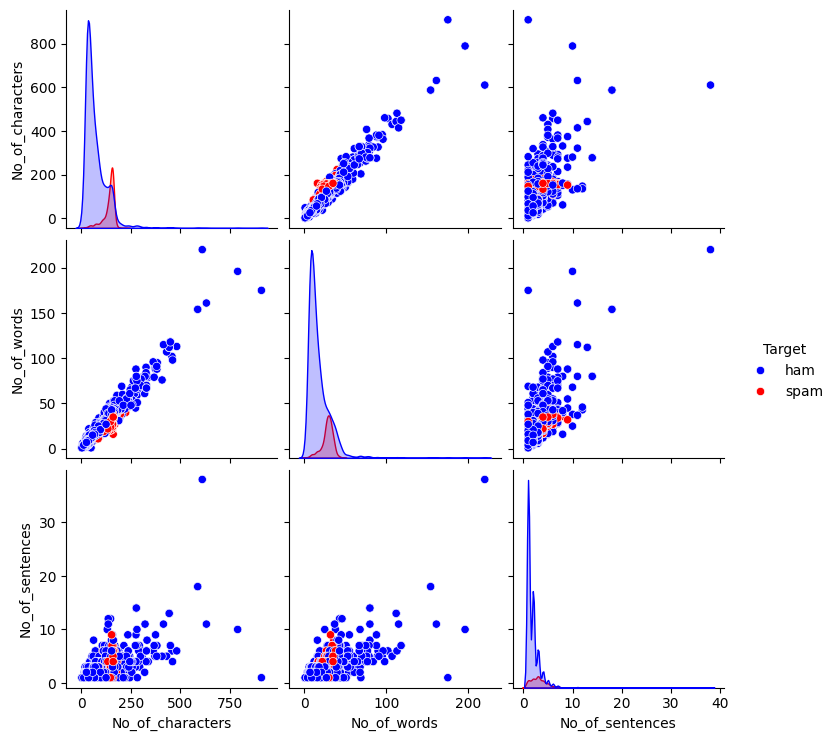
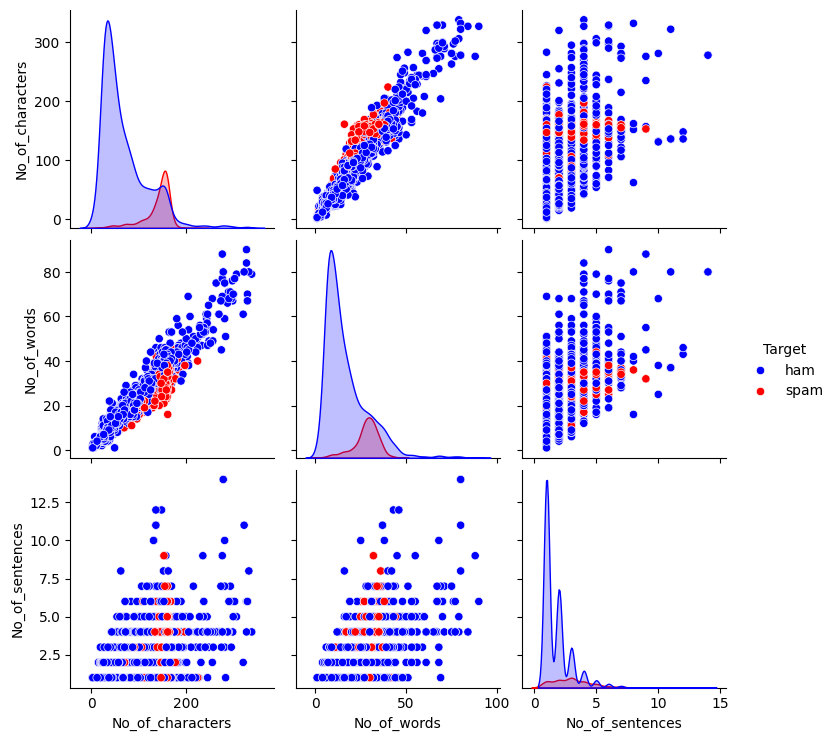

# spam_ham
This project contains a machine learning model to classify SMS messages as either **spam** or **ham**. The entire pipeline, from data preprocessing and feature engineering to model comparison and evaluation, is included. The final model is a `RandomForestClassifier`.

## Project Overview
This project tackles a classic Natural Language Processing (NLP) problem: spam detection. It uses the [SMS Spam Collection Dataset] and applies various techniques:
- **Feature Engineering**: Creating new features like message length, word count, and sentence count.
- **Text Preprocessing**: Cleaning, tokenizing, removing stopwords, and applying lemmatization.
- **Vectorization**: Using `TfidfVectorizer` to convert text into a numerical format.
- **Model Comparison**: Training and evaluating four different classifiers to find the best performer.

---
## Feature Engineering & Data Visualization
To better understand the data, three new features were created: `No_of_characters`, `No_of_words`, and `No_of_sentences`. Outliers (messages with >350 characters) were removed.

The pairplot below shows the distribution and relationships between these features for both spam and ham messages.



---
## Tech Stack
- **Language**: `Python 3.x`
- **Libraries**:
    - `Scikit-learn`: For model training, vectorization, and evaluation.
    - `Pandas`: For data manipulation.
    - `NLTK`: For NLP tasks like tokenization, stopword removal, and lemmatization.
    - `Matplotlib` & `Seaborn`: For data visualization.
    - `Pickle`: For saving the trained model and vectorizer.

---
## Installation
To run this project locally, follow these steps:

1.  Clone the repository:
    ```sh
    git clone [https://github.com/]https://github.com/chakri0176/spam_ham.git
    cd spam_ham
    ```
---
## Model Performance
Four different classification models were trained and evaluated. The performance metrics on the test set are summarized below.

 	           | Precision |	Recall	  |  F1score |
-----------------------------------------------------|
Naive Bayes	   | 1.000000  |	0.705882  |	0.827586 |
Random Forest  | 1.000000  |	0.808824  |	0.894309 |
KNN	           | 0.977778  |	0.323529  |	0.486188 |
SVC	           | 0.990909  |	0.801471  |	0.886179 |

The `RandomForestClassifier` was chosen as the final model due to its high precision and balanced F1-score.

### Confusion Matrices
The confusion matrices for each model provide a visual representation of their performance, showing true positives, true negatives, false positives, and false negatives.


---
## How to Use the Trained Model
To classify a new SMS message, you need to load the saved `model.pkl` file

```python
import pickle

# Load the trained model 
model = pickle.load(open("model.pkl", "rb"))

# Preprocess the new message (must be the same steps as training)
new_message = "Congratulations! You've won a $1,000 gift card. Click here."

# Transform the message using the loaded vectorizer
message_vector = vectorizer.transform([new_message])

# Make a prediction
prediction = model.predict(message_vector)
probability = model.predict_proba(message_vector)

if prediction[0] == 1:
    print(f"Result: SPAM (Confidence: {probability[0][1]:.2f})")
else:
    print(f"Result: HAM (Confidence: {probability[0][0]:.2f})")